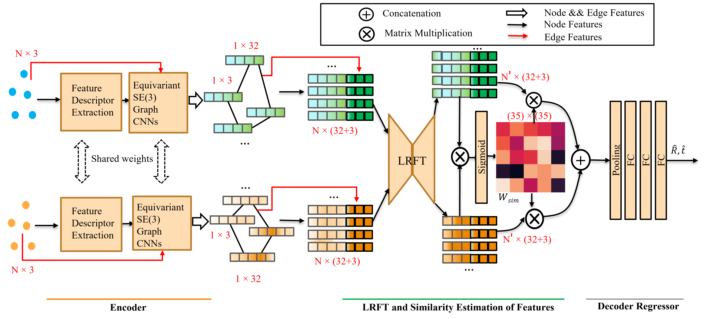

# Equi-GSPR: Equivariant SE(3) Graph Network Model for Sparse Point Cloud Registration

## Introduction

This repository contains the implementation of our Equi-GSPR: Equivariant SE(3) Graph Network Model for Sparse Point Cloud Registration. Our model is designed to process and align 3D point cloud data from various datasets, including 3DMatch and KITTI.
markdown

## System Overview

Below is an overview of our EGNN model architecture:



[Read the full paper here](https://eccv.ecva.net/virtual/2024/poster/944)

## Environment Setup

## Environment Setup
The code is tested on pyg (Pytorch-Geometric) **2.4.0**, **python 3.8**, **Pytorch 2.0.0**, **cuda11.8**, **GPU RAM** at least 8GB with batch size 1 on **GTX 2080** above.

To set up the environment for this project, we use Conda. Follow these steps:

1. Make sure you have Conda installed. If not, you can download it from [here](https://docs.conda.io/en/latest/miniconda.html).

2. Clone this repository, All required packages are specified in the `environment.yml` file. 

$conda env create -f environment.yml
$conda activate egnn-test

## Data

To run this project, you'll need to download the following datasets:

- [3DMatch](https://drive.google.com/file/d/1wr21qFPvgoDWsBnMafew7h-vZfP242Gw/view?usp=drive_link)
- [KITTI](https://drive.google.com/file/d/17u2AWfPIMbgCQUVtXYelgacv_Cyeh6EM/view?usp=sharing)

## Data Processing

For self-processing of data, we provide scripts in the `datasets` folder:

- `3DMatch.py`: For processing 3DMatch dataset
- `KITTI.py`: For processing KITTI dataset

## Training

To train the EGNN model, run the following script `train_egnn.py` in the `src` folder:
$python src/train_egnn.py

## Evaluation

For evaluation, use the `evaluation.py` script located in the `tools` folder:
$python tools/evaluation.py

## Citation

If you find our work useful in your research, please consider citing:

```bibtex
@article{kangequi,
  title={Equi-GSPR: Equivariant SE (3) Graph Network Model for Sparse Point Cloud Registration},
  author={Kang, Xueyang and Luan, Zhaoliang and Khoshelham, Kourosh and Wang, Bing}
}
